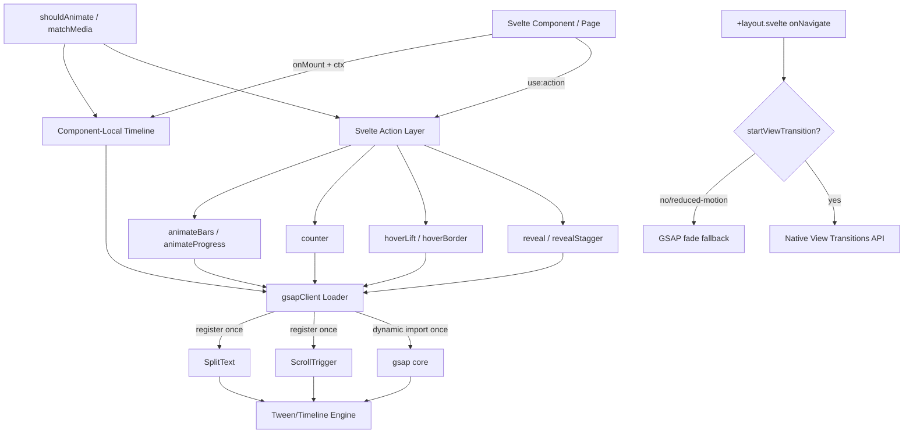
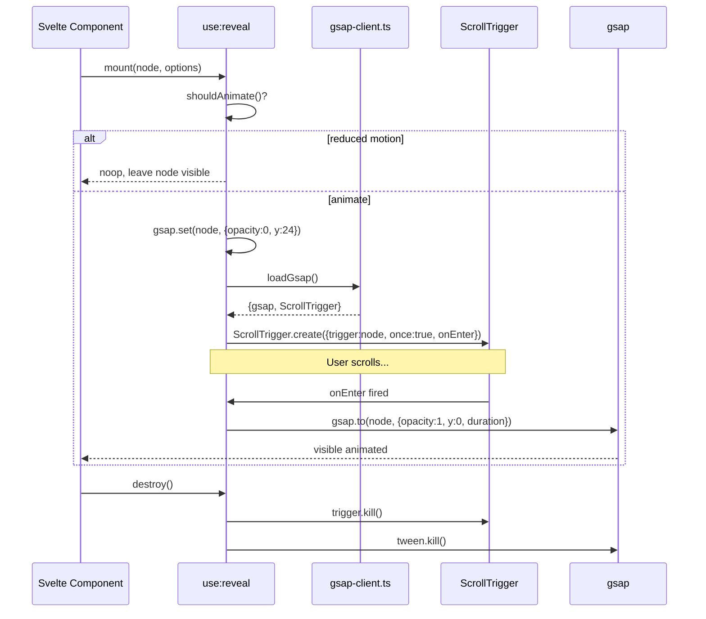
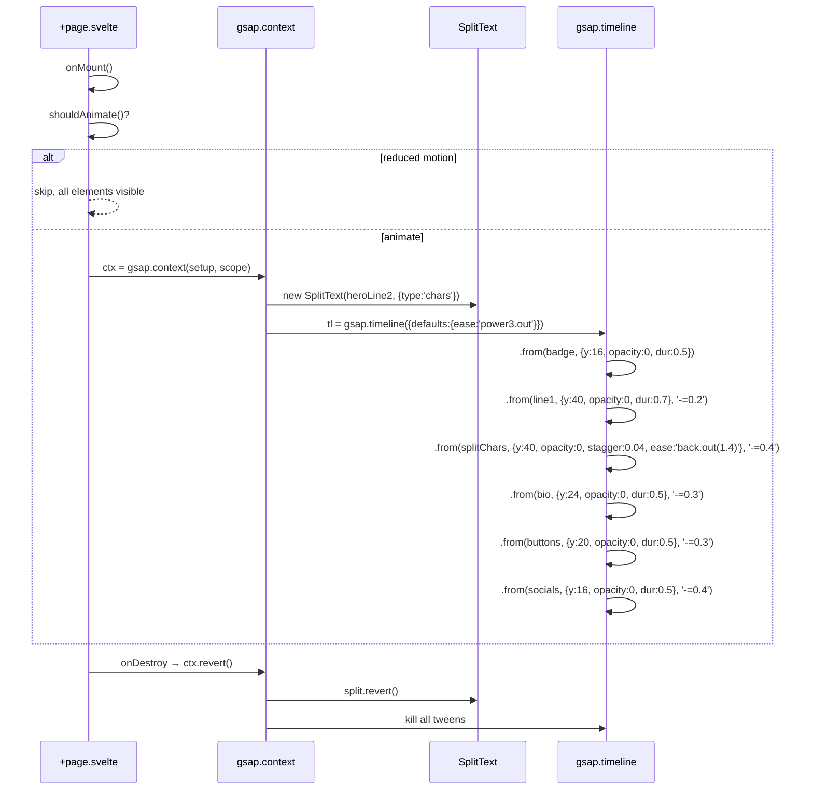

# Design Document: GSAP Animation Enhancement (Full Migration)

## Overview

Fitur ini melakukan migrasi penuh sistem animasi portfolio app dari `motion` (Motion One v12) ke **GSAP 3.13+**. Tujuannya adalah menghasilkan animasi yang lebih halus, lebih ekspresif, dan lebih terkontrol di seluruh public site (home, portfolio, blog, gallery, navbar, page transitions) tanpa menambah biaya lisensi karena GSAP 3.13 telah membebaskan plugin yang dulunya berbayar (SplitText, ScrollSmoother, Flip, MorphSVG, dst).

Migrasi dilakukan dengan tetap mempertahankan **public API** dari Svelte actions yang sudah ada (`reveal`, `revealStagger`, `hoverLift`, `hoverBorder`, `counter`, `animateBars`, `animateProgress`) agar surface yang sudah memakainya tidak perlu diubah selain re-import. Implementasi internal di-rewrite memakai `gsap`, `ScrollTrigger`, dan `SplitText`. View Transitions API tetap dipertahankan untuk page transitions karena merupakan API native browser yang tidak konflik dengan GSAP, dengan fallback GSAP timeline untuk browser yang tidak support.

Selain refactor library, design ini juga membersihkan **bug eksisting** di `src/routes/(public)/+page.svelte` yang memiliki tiga blok `onMount` duplikat untuk hero entrance — semuanya akan dikonsolidasikan menjadi satu `gsap.timeline()` per komponen yang dikelola via `gsap.context()`.

## Architecture

### High-Level Diagram



### Layered Responsibilities

| Layer | File | Responsibility |
|---|---|---|
| Loader | `src/lib/utils/gsap-client.ts` (NEW) | Singleton dynamic import GSAP + plugin registration (idempotent untuk HMR) |
| Tokens | `src/lib/utils/animation.ts` (REFACTOR) | Konstanta durasi, easing GSAP-flavored, stagger, `shouldAnimate()` |
| Actions | `src/lib/actions/*.ts` (REFACTOR) | Public Svelte actions dengan API stabil |
| Component-local | `*.svelte` `onMount` | `gsap.context()` per komponen untuk hero / orchestration |
| Page transitions | `+layout.svelte` | View Transitions API + GSAP fallback |
| Global CSS | `src/app.css` | Marquee tetap CSS keyframe (tidak migrate) |

### Key Architectural Decisions

#### AD-1: Singleton Loader dengan Plugin Registration Sekali

**Problem**: Re-registrasi plugin GSAP saat HMR atau navigasi SPA menyebabkan plugin terdaftar berkali-kali, memboroskan memory dan kadang menimbulkan warning.

**Solution**: `gsap-client.ts` mengekspor satu fungsi `loadGsap()` yang:
1. Memoize Promise hasil `import('gsap')` + `import('gsap/ScrollTrigger')` + `import('gsap/SplitText')`.
2. Memanggil `gsap.registerPlugin(ScrollTrigger, SplitText)` **sekali** dengan flag `__gsapRegistered` di module scope.
3. Mengembalikan `{ gsap, ScrollTrigger, SplitText }` ke caller.
4. SSR-safe: lempar early return `null` jika `typeof window === 'undefined'`.

#### AD-2: SSR Safety via Dynamic Import + onMount

GSAP **tidak boleh** ter-bundle di server karena mengakses `window`/`document`. Strategi:
- Semua action memakai `import('...')` dinamis di dalam handler `mount`/`init`, bukan top-level `import`.
- File `gsap-client.ts` aman di-import secara statis karena hanya mengekspor fungsi loader (tidak menjalankan side effect di module scope).
- Komponen yang memakai timeline custom (hero) wajib bungkus dalam `onMount(async () => {...})`.

#### AD-3: License & Plugin Selection

GSAP 3.13+ membuat seluruh plugin (termasuk SplitText, ScrollSmoother, MorphSVG, Flip) **gratis di bawah lisensi standar GSAP** — boleh dipakai di project komersial. Plugin yang dipakai di scope ini:

| Plugin | Status | Kegunaan |
|---|---|---|
| `gsap` (core) | wajib | Tween, timeline, easing |
| `ScrollTrigger` | wajib | Reveal-on-scroll, navbar progress, scrub |
| `SplitText` | wajib | Hero name char/word reveal "Bagus Tri Atmojo" |
| `Flip` | optional v2 | Tidak dipakai di scope awal (potensi gallery transitions) |
| `ScrollSmoother` | **TIDAK** dipakai | Konflik potensial dengan View Transitions; smoothing native browser sudah memadai |

Bundle estimate (gzipped): `gsap` ~28KB + `ScrollTrigger` ~10KB + `SplitText` ~4KB ≈ **~42KB gzipped**. Saat ini `motion` v12 menghabiskan ~14KB gzipped, jadi net delta **+~28KB**. Dapat diterima karena pengganti lebih powerful dan mengeliminasi custom RAF loop di counter/chart yang berkontribusi ~2KB.

#### AD-4: `gsap.context()` untuk Cleanup Massal

Setiap komponen yang membuat banyak tween/ScrollTrigger lokal (mis. home page hero) wajib bungkus dengan `gsap.context()` agar saat `onDestroy`/cleanup, satu panggilan `ctx.revert()` membersihkan **semua** tween + ScrollTrigger + properti CSS yang di-set GSAP. Ini mencegah memory leak dan menjaga state DOM tetap bersih saat HMR / navigasi SPA.

#### AD-5: Tetap Pertahankan View Transitions API

View Transitions API (`document.startViewTransition`) adalah API native browser yang menangani transisi DOM antar route SPA. GSAP **tidak menggantikan** ini karena:
1. View Transitions bekerja di level paint compositor, jauh lebih efisien daripada animasi JS tween.
2. Sudah ada `view-transition-name: site-logo` di Navbar yang memungkinkan shared element transition gratis.
3. GSAP dipakai untuk **komponen content** di dalam page, bukan transisi root.

GSAP **dipakai sebagai fallback** untuk browser yang tidak support (Firefox stable saat dokumen ini ditulis): timeline fade-out container lama → fade-in container baru, durasi 200ms. Logic seleksi: `if (!('startViewTransition' in document)) → gsap fallback`.

### Sequence Diagram: Reveal-on-Scroll Flow



### Sequence Diagram: Hero Entrance Timeline (Home Page)



## Components and Interfaces

### Component 1: `gsap-client.ts` (Loader)

**Purpose**: Singleton lazy-loader untuk GSAP core + plugin, idempotent terhadap HMR.

**Interface**:
```typescript
// src/lib/utils/gsap-client.ts
import type gsap from 'gsap';
import type { ScrollTrigger } from 'gsap/ScrollTrigger';
import type { SplitText } from 'gsap/SplitText';

export type GsapBundle = {
  gsap: typeof gsap;
  ScrollTrigger: typeof ScrollTrigger;
  SplitText: typeof SplitText;
};

/**
 * Lazy-load gsap core + ScrollTrigger + SplitText.
 * Idempotent: panggilan kedua mengembalikan promise yang sama.
 * Aman dipanggil di SSR (returns null).
 */
export function loadGsap(): Promise<GsapBundle | null>;

/**
 * Kembalikan true bila gsap sudah ter-load minimal sekali.
 * Berguna untuk komponen yang ingin synchronous fall-through.
 */
export function isGsapLoaded(): boolean;
```

**Responsibilities**:
- Memoize promise hasil dynamic import.
- Memanggil `gsap.registerPlugin(ScrollTrigger, SplitText)` tepat satu kali per page lifecycle.
- Mengembalikan `null` saat dipanggil di SSR.
- Menangani Vite HMR: gunakan `import.meta.hot` guard agar tidak duplikat saat hot-reload.

### Component 2: `animation.ts` (Tokens & Helpers)

**Purpose**: Konstanta animasi GSAP-flavored, helper `shouldAnimate()`, `supportsViewTransitions()`.

**Interface**:
```typescript
// src/lib/utils/animation.ts (refactored)

export const DURATION = {
  fast:    0.18,
  normal:  0.4,
  slow:    0.6,
  verySlow: 0.8
} as const;

/**
 * Easing names dari GSAP. Pakai string-based agar konsisten dengan
 * gsap.to/from API. Hindari array bezier custom karena GSAP punya
 * preset yang lebih ekspresif.
 */
export const EASE = {
  out:    'power3.out',     // default reveal
  inOut:  'power2.inOut',
  spring: 'back.out(1.6)',  // overshoot subtle
  expo:   'expo.out',       // counter / dramatic
  smooth: 'power1.out'      // hover
} as const;

export const STAGGER = {
  fast:   0.04,
  normal: 0.07,
  slow:   0.12
} as const;

export function shouldAnimate(): boolean;
export function supportsViewTransitions(): boolean;
```

**Responsibilities**:
- Tidak ada side effect saat di-import.
- Helper `shouldAnimate()` membaca `prefers-reduced-motion` setiap kali dipanggil (tidak dicache, agar perubahan setting OS langsung terdeteksi).

### Component 3: Reveal Actions

**Purpose**: Reveal-on-scroll dengan ScrollTrigger, mempertahankan API public yang sama dengan implementasi `motion` saat ini.

**Interface**:
```typescript
// src/lib/actions/reveal.ts (refactored)
import type { Action } from 'svelte/action';

export type RevealOptions = {
  delay?: number;       // detik (BREAKING dari ms di motion); default 0
  duration?: number;    // detik; default DURATION.slow
  y?: number;           // px translateY awal; default 24
  x?: number;           // px translateX awal; default 0
  scale?: number;       // initial scale; default 1 (no scale)
  once?: boolean;       // animate sekali atau setiap masuk viewport; default true
  amount?: number;      // 0..1 → start saat sebagian elemen visible; default 0.15
  scrub?: boolean | number; // ScrollTrigger scrub; default false
};

export const reveal: Action<HTMLElement, RevealOptions | undefined>;

export type RevealStaggerOptions = Omit<RevealOptions, 'scale'> & {
  stagger?: number;     // detik antar child; default STAGGER.normal
};

export const revealStagger: Action<HTMLElement, RevealStaggerOptions | undefined>;
```

**Responsibilities**:
- Set initial state via `gsap.set()` segera saat action mount (synchronous, sebelum first paint untuk hindari FOUC).
- Buat `ScrollTrigger` dengan `start: 'top bottom-=10%'` (default) atau dihitung dari `amount`.
- Pada `onEnter`, jalankan `gsap.to(node, {opacity:1, y:0, x:0, duration, ease, delay})`.
- Pada `destroy`, panggil `trigger.kill()` + `tween.kill()`.
- Honor `shouldAnimate()`: jika reduced-motion, set elemen visible langsung tanpa animasi.

**Migration Note**: Param `delay` di implementasi `motion` saat ini campuran detik (`reveal`) dan ms (`hoverLift`). Standarkan ke **detik** mengikuti konvensi GSAP. Site-wide audit untuk konversi nilai di call site.

### Component 4: Hover Actions

**Purpose**: Hover lift + glow + border highlight.

**Interface**:
```typescript
// src/lib/actions/hover.ts (refactored)
import type { Action } from 'svelte/action';

export type HoverLiftOptions = {
  y?: number;           // px translateY pada hover; default -4
  scale?: number;       // scale pada hover; default 1
  duration?: number;    // detik; default 0.2
  glowColor?: string;   // CSS color; default 'var(--color-primary)'
  glowIntensity?: number; // 0..1; default 0.2 (alpha boxShadow)
};

export const hoverLift: Action<HTMLElement, HoverLiftOptions | undefined>;

export type HoverBorderOptions = {
  color?: string;       // default 'var(--color-primary)'
  duration?: number;    // detik; default 0.2
};

export const hoverBorder: Action<HTMLElement, HoverBorderOptions | undefined>;
```

**Responsibilities**:
- Buat `gsap.quickTo` di mount untuk performa (avoid re-create tween per hover event).
- Pada `mouseenter`: tweenTo target state.
- Pada `mouseleave`: tweenTo state awal.
- Pada `destroy`: remove listeners + kill quickTo.

### Component 5: Counter Action

**Purpose**: Animate angka 0 → target dengan formatting (locale, decimals, prefix/suffix).

**Interface**:
```typescript
// src/lib/actions/counter.ts (refactored)
import type { Action } from 'svelte/action';

export type CounterOptions = {
  target: number;
  duration?: number;    // detik; default 1.2 (BREAKING dari ms 1200)
  delay?: number;       // detik; default 0
  decimals?: number;    // default 0
  prefix?: string;
  suffix?: string;
  ease?: string;        // GSAP ease name; default EASE.expo
  triggerOnView?: boolean; // default true; jika false, langsung start
};

export const counter: Action<HTMLElement, CounterOptions>;
```

**Responsibilities**:
- Pakai `gsap.to({val: 0}, {val: target, duration, ease, onUpdate: () => formatAndSet()})`.
- Trigger via `ScrollTrigger.create({trigger: node, once: true, onEnter: playTween})`.
- Reduced-motion: set text langsung ke nilai final.

### Component 6: Chart Actions

**Purpose**: Animate bar heights & progress widths.

**Interface**:
```typescript
// src/lib/actions/chart.ts (refactored)
import type { Action } from 'svelte/action';

export type AnimateBarsOptions = {
  delay?: number;       // detik; default 0
  duration?: number;    // detik; default 0.6 (BREAKING dari ms 600)
  stagger?: number;     // detik; default 0.03
  ease?: string;        // default EASE.out
};

export const animateBars: Action<HTMLElement, AnimateBarsOptions | undefined>;

export type AnimateProgressOptions = {
  delay?: number;       // detik
  duration?: number;    // detik; default 0.8
  ease?: string;        // default EASE.out
};

export const animateProgress: Action<HTMLElement, AnimateProgressOptions | undefined>;
```

**Responsibilities**:
- `animateBars`: query `[data-bar]`, simpan target height, set ke 0, `gsap.to` dengan stagger saat ScrollTrigger fired.
- `animateProgress`: tween width dari 0% ke target.
- Reduced-motion: skip animasi, biarkan target style.

### Component 7: Hero Timeline (Home Page)

**Purpose**: Konsolidasi tiga `onMount` duplikat menjadi satu timeline GSAP.

**Pattern** (di `src/routes/(public)/+page.svelte`):
```typescript
let ctx: gsap.Context | undefined;

onMount(() => {
  if (!shouldAnimate()) return;

  loadGsap().then((bundle) => {
    if (!bundle) return;
    const { gsap, SplitText } = bundle;

    ctx = gsap.context(() => {
      const split = new SplitText(heroLine2, { type: 'chars' });

      const tl = gsap.timeline({ defaults: { ease: 'power3.out' } });
      tl.from([heroBadgeMobile, heroBadgeDesktop].filter(Boolean), {
        y: 16, opacity: 0, duration: 0.5
      })
        .from(heroLine1, { y: 40, opacity: 0, duration: 0.7 }, '-=0.2')
        .from(split.chars, { y: 40, opacity: 0, stagger: 0.04, ease: 'back.out(1.4)' }, '-=0.4')
        .from(heroBio, { y: 24, opacity: 0, duration: 0.5 }, '-=0.3')
        .from(heroButtons, { y: 20, opacity: 0, duration: 0.5 }, '-=0.3')
        .from(heroSocials, { y: 16, opacity: 0, duration: 0.5 }, '-=0.4');
    }, /* scope */ document.querySelector('section') as Element);
  });

  return () => ctx?.revert();
});
```

### Component 8: Navbar Scroll Behavior

**Purpose**: Sticky shrink + scroll progress dikendalikan ScrollTrigger.

**Pattern**:
```typescript
let ctx: gsap.Context | undefined;
let progressBar: HTMLElement;

onMount(() => {
  if (!shouldAnimate()) return;

  loadGsap().then((bundle) => {
    if (!bundle) return;
    const { gsap, ScrollTrigger } = bundle;

    ctx = gsap.context(() => {
      // 1. Sticky shrink — toggle class via ScrollTrigger
      ScrollTrigger.create({
        start: 'top top-=20',
        onEnter:     () => (scrolled = true),
        onLeaveBack: () => (scrolled = false)
      });

      // 2. Progress bar — scrub width 0..100%
      gsap.to(progressBar, {
        width: '100%',
        ease: 'none',
        scrollTrigger: {
          trigger: document.documentElement,
          start: 'top top',
          end:   'bottom bottom',
          scrub: 0.3
        }
      });
    });
  });

  return () => ctx?.revert();
});
```

**Improvement vs Saat Ini**:
- Hilangkan custom scroll listener manual + reactive `$derived` chain yang re-render Svelte tiap pixel scroll.
- Progress bar di-tween di luar Svelte reactivity → tidak trigger re-paint berlebihan.

### Component 9: Tech Marquee

**Decision**: **Pertahankan CSS keyframe** (`@keyframes marquee` di `app.css`).

**Rationale**:
- CSS animation sudah berjalan di compositor thread, lebih efisien dari JS tween.
- Pause-on-hover sudah ditangani via `animation-play-state: paused` pada `:hover`.
- Migrasi ke GSAP `gsap.to({xPercent: -50, repeat: -1, duration: 25, ease: 'none'})` tidak memberikan benefit signifikan, tapi menambah ~3KB JS execution.
- **Pengecualian**: Jika ingin variable speed (slow on hover instead of pause), baru migrate. Untuk scope ini, biarkan CSS.

### Component 10: Page Transitions

**Pattern di `+layout.svelte`**:
```typescript
onNavigate((navigation) => {
  if (!shouldAnimate()) return;

  // Path 1: Native View Transitions
  if ('startViewTransition' in document) {
    return new Promise((resolve) => {
      (document as any).startViewTransition(async () => {
        resolve();
        await navigation.complete;
      });
    });
  }

  // Path 2: GSAP fallback (Firefox stable, etc)
  return new Promise((resolve) => {
    loadGsap().then((bundle) => {
      if (!bundle) { resolve(); return; }
      const { gsap } = bundle;
      const main = document.querySelector('main, [data-route-root]');
      if (!main) { resolve(); return; }

      gsap.to(main, {
        opacity: 0, y: -8, duration: 0.18, ease: 'power2.in',
        onComplete: async () => {
          resolve();
          await navigation.complete;
          gsap.fromTo(main, { opacity: 0, y: 8 }, { opacity: 1, y: 0, duration: 0.24, ease: 'power2.out' });
        }
      });
    });
  });
});
```

## Data Models

### Model 1: `GsapBundle`

```typescript
type GsapBundle = {
  gsap: GSAPCore;
  ScrollTrigger: ScrollTriggerStatic;
  SplitText: SplitTextStatic;
};
```

**Validation Rules**:
- `gsap` harus terload sebelum `ScrollTrigger`/`SplitText` direturn.
- Setelah `loadGsap()` resolve sukses, `isGsapLoaded()` MUST return `true`.

### Model 2: `RevealOptions` (sudah didefinisikan di Components)

**Validation Rules**:
- `duration` ≥ 0; nilai 0 = animasi instan (effectively skip).
- `amount` ∈ [0, 1].
- `scrub` boolean atau number ≥ 0.
- `delay` ≥ 0 (detik).

### Model 3: `CounterOptions`

**Validation Rules**:
- `target` MUST finite number (not NaN, not Infinity).
- `decimals` ≥ 0, integer.
- `duration` > 0.

## Algorithmic Pseudocode

### Algorithm: `loadGsap()` (Idempotent Singleton)

```typescript
function loadGsap(): Promise<GsapBundle | null> {
  // Module-scoped state
  let cached: Promise<GsapBundle | null> | null = null;
  let registered = false;
}
```

```pascal
ALGORITHM loadGsap()
INPUT: (none)
OUTPUT: Promise<GsapBundle | null>

BEGIN
  // Step 1: SSR guard
  IF typeof window = 'undefined' THEN
    RETURN Promise.resolve(null)
  END IF

  // Step 2: Memoize
  IF cached ≠ null THEN
    RETURN cached
  END IF

  // Step 3: Concurrent dynamic imports
  cached ← Promise.all([
    dynamic_import('gsap'),
    dynamic_import('gsap/ScrollTrigger'),
    dynamic_import('gsap/SplitText')
  ]).then(([gsapMod, stMod, splitMod]) → {
    gsap          ← gsapMod.default OR gsapMod.gsap
    ScrollTrigger ← stMod.ScrollTrigger
    SplitText     ← splitMod.SplitText

    ASSERT gsap ≠ undefined
    ASSERT ScrollTrigger ≠ undefined
    ASSERT SplitText ≠ undefined

    // Step 4: Register exactly once
    IF NOT registered THEN
      gsap.registerPlugin(ScrollTrigger, SplitText)
      registered ← true
    END IF

    RETURN { gsap, ScrollTrigger, SplitText }
  })

  RETURN cached
END
```

**Preconditions**:
- Pemanggil aman di kedua sisi SSR/CSR (function akan handle).

**Postconditions**:
- Setelah resolve sukses, `gsap.registerPlugin` sudah dipanggil tepat satu kali per process lifecycle.
- Pemanggilan kedua mengembalikan referensi cached yang sama (bukan promise baru).

**Invariants**:
- `registered` MONOTONIC: sekali `true`, tidak pernah kembali `false`.

### Algorithm: `reveal` Action

```pascal
ALGORITHM reveal(node, options)
INPUT: node ∈ HTMLElement, options ∈ RevealOptions
OUTPUT: { destroy: () → void }

BEGIN
  // Step 1: Reduced-motion check
  IF NOT shouldAnimate() THEN
    RETURN { destroy: noop }
  END IF

  // Step 2: SSR guard (extra safety)
  IF typeof window = 'undefined' THEN
    RETURN { destroy: noop }
  END IF

  // Step 3: Default options
  delay    ← options.delay    OR 0
  duration ← options.duration OR DURATION.slow
  y        ← options.y        OR 24
  x        ← options.x        OR 0
  scale    ← options.scale    OR 1
  once     ← options.once     OR true
  amount   ← options.amount   OR 0.15
  scrub    ← options.scrub    OR false

  // Step 4: Set initial state synchronously (avoid FOUC)
  // Use raw style assignment because gsap not loaded yet
  node.style.opacity   ← '0'
  IF y ≠ 0 OR x ≠ 0 OR scale ≠ 1 THEN
    node.style.transform ← `translate(${x}px, ${y}px) scale(${scale})`
  END IF
  node.style.willChange ← 'transform, opacity'

  // Step 5: Defer GSAP setup
  let trigger ← null
  let tween   ← null

  loadGsap().then(bundle → {
    IF bundle = null THEN RETURN
    { gsap, ScrollTrigger } ← bundle

    // Compute start position from amount
    startPos ← `top bottom-=${(amount * 100)}%`

    trigger ← ScrollTrigger.create({
      trigger: node,
      start: startPos,
      once: once AND NOT scrub,
      scrub: scrub,
      onEnter: () → {
        tween ← gsap.to(node, {
          opacity: 1,
          x: 0,
          y: 0,
          scale: 1,
          duration: duration,
          delay: delay,
          ease: EASE.out,
          clearProps: 'willChange',
          overwrite: 'auto'
        })
      }
    })
  })

  // Step 6: Cleanup
  RETURN {
    destroy: () → {
      IF trigger ≠ null THEN trigger.kill()
      IF tween ≠ null   THEN tween.kill()
    }
  }
END
```

**Preconditions**:
- `node` adalah `HTMLElement` yang attached ke DOM.

**Postconditions**:
- Selesai tween: `node.style.opacity = '1'`, transform identity.
- `destroy()` membersihkan ScrollTrigger + tween, tidak ada referensi yang tertinggal di registry global.

**Invariants**:
- Selama action hidup, paling banyak ada satu `tween` aktif dan satu `trigger` aktif untuk `node` ini.

### Algorithm: `counter` Action

```pascal
ALGORITHM counter(node, options)
INPUT: node ∈ HTMLElement, options ∈ CounterOptions
OUTPUT: { destroy: () → void, update?: (newOpts) → void }

BEGIN
  // Step 1: Validate
  ASSERT options.target ≠ NaN
  ASSERT isFinite(options.target)

  duration ← options.duration OR 1.2
  delay    ← options.delay    OR 0
  decimals ← options.decimals OR 0
  prefix   ← options.prefix   OR ''
  suffix   ← options.suffix   OR ''
  ease     ← options.ease     OR EASE.expo

  // Step 2: Reduced-motion fast path
  IF NOT shouldAnimate() THEN
    node.textContent ← formatValue(options.target, decimals, prefix, suffix)
    RETURN { destroy: noop }
  END IF

  // Step 3: Set initial display
  node.textContent ← formatValue(0, decimals, prefix, suffix)

  let trigger ← null
  let tween   ← null

  loadGsap().then(bundle → {
    IF bundle = null THEN RETURN
    { gsap, ScrollTrigger } ← bundle

    // Step 4: Use a proxy object for tweening
    proxy ← { val: 0 }

    trigger ← ScrollTrigger.create({
      trigger: node,
      start: 'top bottom-=10%',
      once: true,
      onEnter: () → {
        tween ← gsap.to(proxy, {
          val: options.target,
          duration: duration,
          delay: delay,
          ease: ease,
          onUpdate: () → {
            node.textContent ← formatValue(proxy.val, decimals, prefix, suffix)
          },
          onComplete: () → {
            // Snap to exact target to avoid floating point drift
            node.textContent ← formatValue(options.target, decimals, prefix, suffix)
          }
        })
      }
    })
  })

  RETURN {
    destroy: () → {
      IF trigger ≠ null THEN trigger.kill()
      IF tween ≠ null   THEN tween.kill()
    }
  }
END

ALGORITHM formatValue(value, decimals, prefix, suffix)
INPUT: value ∈ ℝ, decimals ∈ ℕ, prefix ∈ String, suffix ∈ String
OUTPUT: String

BEGIN
  IF decimals > 0 THEN
    formatted ← value.toFixed(decimals)
  ELSE
    formatted ← Math.round(value).toLocaleString()
  END IF
  RETURN prefix + formatted + suffix
END
```

**Preconditions**:
- `options.target` finite.
- `decimals` ≥ 0.

**Postconditions**:
- Setelah animasi selesai (atau reduced-motion), `node.textContent` MUST = `formatValue(target, decimals, prefix, suffix)` exactly.

**Invariants**:
- Selama tween berjalan, `node.textContent` selalu = `formatValue(currentVal, decimals, prefix, suffix)` untuk `currentVal ∈ [0, target]`.

### Algorithm: `hoverLift` Action (with quickTo Optimization)

```pascal
ALGORITHM hoverLift(node, options)
INPUT: node ∈ HTMLElement, options ∈ HoverLiftOptions
OUTPUT: { destroy: () → void }

BEGIN
  IF NOT shouldAnimate() THEN
    RETURN { destroy: noop }
  END IF

  y         ← options.y         OR -4
  scale     ← options.scale     OR 1
  duration  ← options.duration  OR 0.2
  glow      ← options.glowColor OR 'var(--color-primary)'

  let yTo, scaleTo, shadowTo
  let onEnter, onLeave

  loadGsap().then(bundle → {
    IF bundle = null THEN RETURN
    { gsap } ← bundle

    // quickTo creates a high-performance setter
    yTo     ← gsap.quickTo(node, 'y',     { duration, ease: EASE.smooth })
    scaleTo ← gsap.quickTo(node, 'scale', { duration, ease: EASE.smooth })

    onEnter ← () → {
      yTo(y)
      IF scale ≠ 1 THEN scaleTo(scale)
      gsap.to(node, {
        boxShadow: `0 8px 32px -8px ${glow}33`,
        duration: duration,
        ease: EASE.smooth
      })
    }

    onLeave ← () → {
      yTo(0)
      IF scale ≠ 1 THEN scaleTo(1)
      gsap.to(node, {
        boxShadow: '0 0 0 0 transparent',
        duration: duration * 1.4,
        ease: EASE.smooth
      })
    }

    node.addEventListener('mouseenter', onEnter)
    node.addEventListener('mouseleave', onLeave)
  })

  RETURN {
    destroy: () → {
      IF onEnter ≠ undefined THEN node.removeEventListener('mouseenter', onEnter)
      IF onLeave ≠ undefined THEN node.removeEventListener('mouseleave', onLeave)
      // gsap.killTweensOf cleans up any in-flight tweens
      IF window.gsap THEN window.gsap.killTweensOf(node)
    }
  }
END
```

**Preconditions**:
- `node` adalah element yang reasonable untuk transform (bukan inline element).

**Postconditions**:
- Setelah `mouseleave`, dalam waktu `duration * 1.4`, node kembali ke `y=0, scale=1, boxShadow=transparent`.
- `destroy()` MUST menghapus semua listener.

**Invariants**:
- `quickTo` setter direkam sekali, dipakai banyak kali tanpa re-create tween (zero-allocation hover path).

## Key Functions with Formal Specifications

### Function 1: `loadGsap()`

```typescript
export function loadGsap(): Promise<GsapBundle | null>
```

**Preconditions**:
- Boleh dipanggil di SSR (akan return promise null).
- Boleh dipanggil concurrent dari multiple call sites.

**Postconditions**:
- Resolves dengan `GsapBundle` di browser, `null` di SSR.
- Side effect: `gsap.registerPlugin(ScrollTrigger, SplitText)` dipanggil tepat 1 kali per process lifecycle.
- Idempotent: panggilan ke-N (N > 1) mengembalikan referensi yang sama dengan panggilan pertama.

**Loop Invariants**: N/A (no loops).

### Function 2: `shouldAnimate()`

```typescript
export function shouldAnimate(): boolean
```

**Preconditions**: tidak ada.

**Postconditions**:
- Return `false` di SSR.
- Return `!matchMedia('(prefers-reduced-motion: reduce)').matches` di browser.
- Side-effect-free.

### Function 3: `formatValue(value, decimals, prefix, suffix)` (counter helper)

```typescript
function formatValue(value: number, decimals: number, prefix: string, suffix: string): string
```

**Preconditions**:
- `decimals` ≥ 0, integer.
- `value` finite.

**Postconditions**:
- Untuk `decimals = 0`: result = `prefix + Math.round(value).toLocaleString() + suffix`.
- Untuk `decimals > 0`: result = `prefix + value.toFixed(decimals) + suffix`.
- Idempotent: `formatValue(formatValue(...), ...)` tidak relevan (bukan fungsi terhadap dirinya).
- Pure function: tidak ada side effect.

### Function 4: `reveal` action mount handler

```typescript
const reveal: Action<HTMLElement, RevealOptions | undefined>
```

**Preconditions**:
- `node` MUST attached ke DOM saat action mount.

**Postconditions**:
- Setelah viewport entry (atau immediate jika `scrub`):
  - `getComputedStyle(node).opacity = '1'`
  - `getComputedStyle(node).transform` ≈ identity (tolerance: GSAP `clearProps`)
- `destroy()` MUST tidak meninggalkan ScrollTrigger registry entry untuk `node` (verifiable via `ScrollTrigger.getAll().some(t => t.trigger === node) === false`).

## Example Usage

### Example 1: Reveal-on-scroll dasar
```svelte
<script>
  import { reveal } from '$lib/actions/reveal';
</script>

<section use:reveal>
  <h2>Featured Projects</h2>
</section>

<!-- Dengan custom params -->
<div use:reveal={{ y: 40, delay: 0.2, duration: 0.6 }}>
  Content masuk dari bawah dengan delay 200ms.
</div>
```

### Example 2: Stagger reveal pada grid
```svelte
<div use:revealStagger={{ stagger: 0.08, y: 32 }}
     class="grid grid-cols-3 gap-6">
  {#each projects as project}
    <ProjectCard {project} />
  {/each}
</div>
```

### Example 3: Hero entrance dengan SplitText
```svelte
<script lang="ts">
  import { onMount, onDestroy } from 'svelte';
  import { loadGsap } from '$lib/utils/gsap-client';
  import { shouldAnimate } from '$lib/utils/animation';

  let heroLine2: HTMLElement;
  let ctx: any;

  onMount(async () => {
    if (!shouldAnimate()) return;
    const bundle = await loadGsap();
    if (!bundle) return;
    const { gsap, SplitText } = bundle;

    ctx = gsap.context(() => {
      const split = new SplitText(heroLine2, { type: 'chars' });
      gsap.from(split.chars, {
        y: 40, opacity: 0, stagger: 0.04,
        ease: 'back.out(1.4)', duration: 0.7
      });
    });
  });

  onDestroy(() => ctx?.revert());
</script>

<h1 bind:this={heroLine2}>Atmojo</h1>
```

### Example 4: Counter
```svelte
<span use:counter={{ target: 1234, suffix: '+', duration: 1.4 }}>0</span>
```

### Example 5: Hover lift on card
```svelte
<a href={`/portfolio/${project.slug}`}>
  <div use:hoverLift={{ y: -5 }} class="rounded-xl border bg-card">
    ...
  </div>
</a>
```

### Example 6: Page transition (fallback path)
```svelte
<!-- +layout.svelte -->
<script>
  onNavigate((nav) => {
    if (!shouldAnimate()) return;
    if ('startViewTransition' in document) {
      // Native path
      return new Promise((res) => document.startViewTransition(async () => {
        res(); await nav.complete;
      }));
    }
    // GSAP fallback path (lihat Component 10)
  });
</script>
```

## Correctness Properties

*Properti adalah karakteristik atau perilaku yang harus berlaku across all valid eksekusi sistem. Properti di sini akan dipetakan ke requirement spesifik di Phase 2 setelah requirements.md dibuat. Untuk sekarang, properti dirumuskan dalam bentuk universal quantification.*

### Property 1: Reduced-motion respect
*For all* element yang memakai action GSAP (reveal, hoverLift, counter, animateBars, animateProgress) ATAU komponen dengan timeline GSAP custom, IF `prefers-reduced-motion: reduce` aktif, THEN element TIDAK mengalami animasi: opacity langsung 1, transform identity, counter langsung menampilkan nilai final.

**Validates: (akan dipetakan setelah requirements.md selesai)**

### Property 2: Cleanup completeness
*For all* Svelte action GSAP yang di-mount, setelah `destroy()` dipanggil:
- `ScrollTrigger.getAll().filter(t => t.trigger === node)` MUST `[]` (kosong).
- Tidak ada tween aktif yang menargetkan `node` (`gsap.getTweensOf(node).length === 0`).
- Tidak ada event listener yang tersisa untuk action tersebut.

**Validates: (mapping pending)**

### Property 3: Single plugin registration
*For all* sequence pemanggilan `loadGsap()` (termasuk dari multiple components secara concurrent dan setelah HMR), `gsap.registerPlugin(ScrollTrigger, SplitText)` dipanggil tepat **satu kali** per process lifecycle.

**Validates: (mapping pending)**

### Property 4: Counter formatting correctness
*For all* `(value, decimals, prefix, suffix)` di mana `value` finite dan `decimals ≥ 0`:
- `formatValue(value, 0, p, s) = p + Math.round(value).toLocaleString() + s`
- `formatValue(value, d, p, s) = p + value.toFixed(d) + s` (untuk d > 0)
- `formatValue(0, d, p, s)` selalu valid string (no NaN/undefined).
- Setelah counter tween selesai, `node.textContent === formatValue(target, decimals, prefix, suffix)`.

**Validates: (mapping pending)**

### Property 5: Reveal idempotence on viewport re-entry (when `once: true`)
*For all* element dengan `use:reveal` dan `options.once = true` (default), animasi reveal dipicu **tepat satu kali** meskipun element keluar-masuk viewport berkali-kali. Element MUST tetap di state final (visible) setelah trigger pertama.

**Validates: (mapping pending)**

### Property 6: SSR safety
*For all* file yang meng-import `gsap-client.ts`, `animation.ts`, atau action files secara statis, `npm run build` MUST sukses tanpa error "window is not defined" atau "document is not defined".

**Validates: (mapping pending)**

### Property 7: Hero timeline single-source
*For all* render home page, hero entrance animation di-orchestrate oleh **tepat satu** timeline GSAP (bukan multiple `onMount` yang menjalankan animasi paralel ke target yang sama). Diverify dengan: jumlah tween yang menarget `heroLine1` dalam window `[onMount, onMount + 2s]` ≤ 1.

**Validates: (mapping pending)**

### Property 8: Page transition graceful degradation
*For all* navigasi SPA via SvelteKit `goto`/link click:
- Browser support View Transitions → animasi via `document.startViewTransition`.
- Browser TIDAK support → animasi via GSAP fade timeline.
- `prefers-reduced-motion` aktif → tidak ada animasi, navigasi langsung.

**Validates: (mapping pending)**

### Property 9: Hover symmetry
*For all* element dengan `use:hoverLift`, sequence `mouseenter → mouseleave` MUST mengembalikan element ke state visual awal (`y=0, scale=1, boxShadow≈transparent`) dalam waktu maksimum `duration * 1.4` detik dari mouseleave.

**Validates: (mapping pending)**

### Property 10: ScrollTrigger leak prevention on HMR
*For all* siklus Vite HMR yang me-replace komponen, `ScrollTrigger.getAll().length` setelah HMR ≤ jumlah ScrollTrigger semantically expected (tidak akumulasi ghost trigger dari versi komponen sebelumnya).

**Validates: (mapping pending)**

## Error Handling

### Error Scenario 1: GSAP gagal di-load (network error / chunk load failure)

**Condition**: `import('gsap')` reject (mis. kehilangan koneksi, CDN/static asset 404).

**Response**:
- `loadGsap()` re-throws ke caller.
- Action: tangkap error di `.catch()`, log ke console (`console.warn('GSAP failed to load, animations disabled')`), biarkan element di state initial yang sudah di-set (jika sudah di-set ke opacity 0 → fallback ke `opacity: 1`).

**Recovery**:
- Action `destroy()` aman dipanggil meskipun load gagal (idempotent).
- Reload page akan re-attempt load.

### Error Scenario 2: SplitText gagal split (target element kosong / null)

**Condition**: `new SplitText(heroLine2, { type: 'chars' })` di-call dengan `heroLine2` yang `undefined` atau tidak ada text content.

**Response**:
- Wrap dalam try/catch di hero timeline setup.
- Jika gagal: skip char-level animation, fallback ke whole-line `.from({y: 40, opacity: 0})`.

**Recovery**:
- Page tetap fungsional, hanya kehilangan animasi per-character pada nama "Atmojo".

### Error Scenario 3: ScrollTrigger refresh race condition

**Condition**: ScrollTrigger di-create sebelum DOM layout final (mis. font belum loaded → height berubah).

**Response**:
- Setelah `loadGsap()` resolve, panggil `ScrollTrigger.refresh()` secara debounced setelah `document.fonts.ready`.

**Recovery**:
- Auto-refresh menempatkan trigger pada posisi yang benar.

### Error Scenario 4: Memory leak dari ScrollTrigger pada navigasi SPA

**Condition**: User navigasi route SvelteKit, komponen unmount, tapi ScrollTrigger masih tercatat di registry global.

**Response**:
- Setiap action `destroy()` MUST kill trigger.
- Setiap komponen dengan `gsap.context()` MUST `ctx.revert()` di `onDestroy`.
- Layout-level safety net: `+layout.svelte` `onNavigate` panggil `ScrollTrigger.refresh()` setelah navigasi (memaksa stale trigger reposition; trigger yang hanya ke-element yang sudah unmount otomatis ke-killed via Svelte action destroy).

**Recovery**:
- Verifikasi via DevTools: jumlah ScrollTrigger setelah 5 kali navigasi balik-balik MUST stable, tidak terus naik.

### Error Scenario 5: Reduced-motion user mengubah setting saat aplikasi running

**Condition**: User toggle `prefers-reduced-motion` di OS settings tanpa reload page.

**Response**:
- `shouldAnimate()` membaca matchMedia setiap kali (tidak cached). Animasi yang berjalan saat ini tidak di-interrupt, tapi animasi baru akan honor setting baru.
- (Out of scope) Listener `matchMedia('(prefers-reduced-motion: reduce)').addEventListener('change', ...)` untuk live toggle — bisa ditambahkan di v2.

### Error Scenario 6: Hero element ref null (element belum render)

**Condition**: `bind:this` ref di home page belum populated saat `onMount` jalan (race condition).

**Response**:
- Filter `null`/`undefined` dari array sebelum di-pass ke timeline:
  `[heroBadgeMobile, heroBadgeDesktop, heroLine1, ...].filter(Boolean)`.
- Jika ref tetap null setelah `await tick()`, log warning, lanjut tanpa element tersebut.

## Testing Strategy

### Unit Testing Approach

**Framework**: Vitest (perlu di-add jika belum ada; cek `package.json`).

**Coverage Target**:
- `gsap-client.ts` `loadGsap()` idempotency: ≥ 95%.
- `animation.ts` `shouldAnimate()`, `supportsViewTransitions()`: 100%.
- Counter `formatValue()` (extract jadi pure function): 100% — uji semua kombinasi `decimals × value × prefix/suffix`.

**Test Cases**:
- `formatValue(1234, 0, '', '')` → `'1,234'` (locale dependent — gunakan `toLocaleString` mock atau jest locale fix).
- `formatValue(0.567, 2, '$', '')` → `'$0.57'`.
- `formatValue(NaN, 0, '', '')` → graceful (throw or return `'NaN'`?). **Decision**: throw assertion error in dev, return target value as-is in production.
- `shouldAnimate()` mocked matchMedia returns true/false correctly.
- `loadGsap()` called twice → same promise reference (`===`).

### Property-Based Testing Approach

**Framework**: `fast-check` (Vitest compatible).

**Property Test Library**: fast-check.

**Properties**:
1. **`formatValue` round-trip** (Property 4 derivative): For all `value ∈ [-1e9, 1e9]` finite, `decimals ∈ [0, 10]`:
   - `formatValue(value, decimals, '', '')` adalah string yang dapat di-parse kembali ke nilai dengan tolerance `10^-decimals`.
2. **`shouldAnimate` consistency**: For all `n` panggilan berturut-turut tanpa perubahan matchMedia mock, hasil identik.
3. **Reveal options defaulting**: For all subset options yang missing, hasil tween config menggunakan default DURATION/EASE/STAGGER yang diharapkan.

**Iteration**: Minimum 100 per property.

### Integration Testing Approach

**Framework**: Playwright (atau Vitest browser mode dengan jsdom — preferred Playwright untuk real GSAP).

**Critical Flows**:
1. **Hero entrance plays once**: Visit `/`, wait 2s, assert tidak ada animasi tambahan menjalankan ke `heroLine1` (no flicker).
2. **Reveal-on-scroll**: Visit `/portfolio`, scroll ke bawah, assert grid items menjadi visible secara bertahap (stagger).
3. **Page transition**: Click link `/` → `/portfolio`, assert tidak ada flash putih, durasi transisi ≈ 300ms ± 50ms.
4. **Reduced-motion**: Set Playwright `prefers-reduced-motion: reduce`, visit `/`, assert hero langsung visible (tidak ada delay 600ms+).
5. **HMR safety**: (manual) edit file → save → assert ScrollTrigger count tidak ber-akumulasi.

## Performance Considerations

### Bundle Size Budget

| Bundle | Saat ini (motion v12) | Target (GSAP) | Delta |
|---|---|---|---|
| Animation libs (gzipped) | ~14KB | ~42KB | +28KB |
| Custom RAF code dieliminasi | -2KB | 0 | -2KB |
| **Net** | | | **+26KB** |

**Mitigation**:
- Lazy load via dynamic import → tidak masuk initial bundle SSR.
- GSAP chunk akan di-cache aggressively (immutable assets di Vercel CDN).
- Plugins (ScrollTrigger, SplitText) di-import dalam Promise.all paralel → tidak waterfall.

### Lighthouse Performance Targets

| Metric | Saat ini (estimasi) | Target |
|---|---|---|
| LCP (Largest Contentful Paint) | < 2.5s | < 2.5s (no regression) |
| TBT (Total Blocking Time) | < 200ms | < 250ms (allow +50ms for GSAP init) |
| CLS (Cumulative Layout Shift) | < 0.1 | < 0.1 (reveal MUST set initial size, no shift) |
| FCP | < 1.5s | < 1.5s |

**Risk**: SplitText membuat banyak `<div>` per character → bisa naikkan DOM node count di hero. Mitigasi: hanya split `heroLine2` (kata "Atmojo", 6 char). Acceptable.

### Runtime Performance

- **Hover (`quickTo`)**: zero-allocation per hover event setelah init. Tidak menciptakan tween baru.
- **Reveal**: 1 ScrollTrigger + 1 tween per element. Total trigger di home page ≤ 8.
- **Marquee**: tetap CSS, 0 JS overhead per frame.
- **Page transition**: View Transitions API native, tidak menambah JS frame work.

### `force3D` Strategy

- Default GSAP 3 sudah pakai `force3D: 'auto'` → translate3d hanya ketika diperlukan. Biarkan default.
- `will-change: transform, opacity` di-set hanya selama animasi aktif, di-clear via `clearProps: 'willChange'` saat selesai.

## Security Considerations

- **Tidak ada user input ke GSAP**: semua argumen tween hardcoded atau dari options Svelte action yang di-pass developer. Tidak ada XSS surface dari GSAP.
- **Source map**: GSAP source map di production di-strip oleh Vite default. Pastikan `build.sourcemap = false` di `vite.config.ts` untuk production.
- **CSP**: GSAP tidak memerlukan `unsafe-eval`. Tidak perlu mengubah Content Security Policy yang ada.

## Dependencies

### To Add
- `gsap@^3.13.0` — core + ScrollTrigger + SplitText (semua satu package).

### To Remove
- `motion@^12.38.0` — replace seluruhnya.

### Verifikasi
```bash
npm install gsap@^3.13.0
npm uninstall motion
npm run check     # svelte-check harus pass
npm run build     # SSR build harus pass tanpa "window is not defined"
```

### Compat Notes
- `gsap` ESM: import via `import gsap from 'gsap'` dan `import { ScrollTrigger } from 'gsap/ScrollTrigger'`.
- TypeScript types ter-bundle di package `gsap`, tidak perlu `@types/gsap`.
- Vercel adapter: tidak ada konfigurasi tambahan yang diperlukan.

## Migration Plan: motion → GSAP

### Mapping Table

| Saat ini (motion) | Pengganti (GSAP) |
|---|---|
| `import { animate } from 'motion'; animate(el, {opacity:[0,1], y:[24,0]}, {duration:0.6, easing:[...]})` | `gsap.fromTo(el, {opacity:0, y:24}, {opacity:1, y:0, duration:0.6, ease:'power3.out'})` |
| `inView(el, callback, {amount:0.2})` | `ScrollTrigger.create({trigger:el, start:'top bottom-=20%', onEnter:callback, once:true})` |
| `animate(el, {y:[null,-4]}, {duration:0.2})` (hover) | `gsap.to(el, {y:-4, duration:0.2, ease:'power1.out'})` atau `quickTo` |
| Custom RAF `requestAnimationFrame` di counter/chart | `gsap.to({val:0}, {val:target, duration, onUpdate})` |
| Easing array `[0.34, 1.56, 0.64, 1.0]` (spring) | `'back.out(1.6)'` |
| Easing array `[0.0, 0.0, 0.2, 1.0]` (out) | `'power3.out'` |
| Easing array `[0.4, 0.0, 0.2, 1.0]` (inOut) | `'power2.inOut'` |

### Migration Phases

**Phase 1: Foundation** (parallel-safe, tidak block UI)
- Add `gsap` dependency.
- Create `gsap-client.ts` loader.
- Refactor `animation.ts` constants ke EASE names.

**Phase 2: Refactor Actions** (parallel-able — actions independen)
- `reveal.ts` + `revealStagger.ts`
- `hover.ts` (`hoverLift`, `hoverBorder`)
- `counter.ts`
- `chart.ts` (`animateBars`, `animateProgress`)

**Phase 3: Surfaces** (parallel-able)
- Home hero (sekaligus fix bug 3 onMount duplikat).
- Navbar scroll/progress.
- Page transitions di `+layout.svelte`.

**Phase 4: Cleanup**
- `npm uninstall motion`.
- Verify build, lint, type-check pass.
- Lighthouse audit.

### Surface-by-Surface Checklist

| Surface | Aksi |
|---|---|
| Home hero | Konsolidasi 3 onMount → 1 timeline + SplitText |
| Home tech marquee | TIDAK migrate (keep CSS) |
| Home featured projects | `revealStagger` (no source change, action di-rewrite) |
| Home blog carousel | `reveal` + `hoverLift` (no source change) |
| Home CTA | `reveal` (no source change) |
| Portfolio list | `reveal`, `revealStagger` (no source change) |
| Portfolio detail | `reveal` × 4 (no source change) |
| Blog list | `reveal` × 3 (no source change) |
| Blog detail | `reveal` × 4 (no source change) |
| Gallery list | `reveal` per FeedPost (no source change) |
| Navbar | Refactor scroll listener → ScrollTrigger |
| Page transitions | Add GSAP fallback path |
| ProjectCard | `hoverLift` (no source change) |
| PostCard | `hoverLift` (no source change) |
