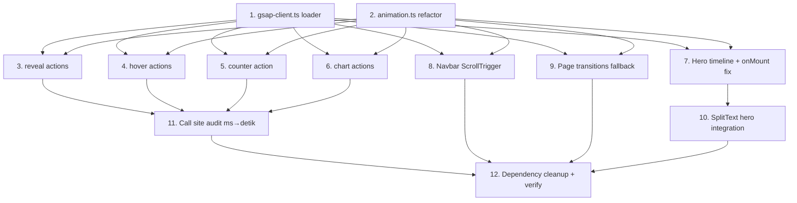

# Implementation Plan: GSAP Animation Enhancement (Full Migration)

## Notes for Implementers

- **Bahasa**: TypeScript strict, Svelte 5 runes (`$state`, `$derived`, `$props`).
- **Imports**: Gunakan dynamic `import('gsap')` SAHAJA via `loadGsap()`. Top-level `import 'gsap'` DILARANG (SSR safety).
- **Cleanup**: Setiap action wajib `destroy()` yang kill tween + ScrollTrigger. Komponen yang pakai `gsap.context()` wajib `ctx.revert()` di `onDestroy`.
- **Reduced motion**: Selalu cek `shouldAnimate()` di entry point.
- **API stability**: Public Svelte action signature TIDAK boleh berubah selain konversi `delay`/`duration` ke detik.
- **Breaking change**: Call site existing yang pakai `delay: 200` (ms) HARUS dikonversi ke `delay: 0.2` (detik). Audit lengkap di Task 11.

## Task Dependency Graph

## Tasks

- [x] 1. Create GSAP singleton lazy loader (`src/lib/utils/gsap-client.ts`)

  - [x] 1.1 Create `src/lib/utils/gsap-client.ts` with module-scope state (`cached: Promise | null`, `registered: boolean`).
  - [x] 1.2 Implement `loadGsap(): Promise<GsapBundle | null>` with SSR guard (`typeof window === 'undefined' → null`).
  - [x] 1.3 Implement memoization: second+ calls return identical promise reference.
  - [x] 1.4 Implement plugin registration: call `gsap.registerPlugin(ScrollTrigger, SplitText)` exactly once via `registered` flag.
  - [x] 1.5 Implement HMR safety: persist `registered` flag via `globalThis.__gsapRegistered` so HMR module replacement doesn't double-register.
  - [x] 1.6 Implement `isGsapLoaded(): boolean` that returns `registered`.
  - [x] 1.7 Export TypeScript types `GsapBundle`, with proper type imports from `gsap`, `gsap/ScrollTrigger`, `gsap/SplitText`.
  - [x] 1.8 Handle import failure: re-throw error from `import('gsap')` to caller; do NOT swallow.
  - _Requirements: 1.1, 1.2, 1.3, 1.4, 1.5, 1.6, 1.7, 1.8, 1.9, 12.2, 12.3_
  - _Properties Validated: 3, 6_

- [x] 2. Refactor animation tokens & helpers (`src/lib/utils/animation.ts`)

  - [x] 2.1 Replace `EASING` array bezier with `EASE` GSAP-flavored string names: `out: 'power3.out'`, `inOut: 'power2.inOut'`, `spring: 'back.out(1.6)'`, `expo: 'expo.out'`, `smooth: 'power1.out'`. Keep `EASING` deprecated re-export for one cycle? **Decision**: hard rename — call sites are limited.
  - [x] 2.2 Update `DURATION` to ensure values are in seconds (already are). Keep `fast=0.18, normal=0.4, slow=0.6, verySlow=0.8`.
  - [x] 2.3 Update `STAGGER` to `fast=0.04, normal=0.07, slow=0.12` (seconds).
  - [x] 2.4 Keep `shouldAnimate()`: SSR returns `false`, browser reads `matchMedia('(prefers-reduced-motion: reduce)').matches` fresh every call (no caching).
  - [x] 2.5 Keep `supportsViewTransitions()`: returns `'startViewTransition' in document` after SSR guard.
  - [x] 2.6 Remove `revealOnScroll()` helper from this file (it's replaced by the `reveal` action; keep file focused on tokens + helpers only).
  - [x] 2.7 Mark all exported objects with `as const` for read-only typing.
  - [x] 2.8 Run `npm run check` to verify no type regressions in files importing tokens.
  - _Requirements: 2.1, 2.2, 2.3, 2.4, 2.5, 2.6, 2.7, 2.8, 2.9, 2.10_

- [x] 3. Refactor reveal actions (`src/lib/actions/reveal.ts`)

  - [x] 3.1 Refactor `reveal` action to use `loadGsap()` + ScrollTrigger.
  - [x] 3.2 Set initial state synchronously via raw `node.style` assignment (opacity 0, transform) BEFORE `loadGsap()` resolves to prevent FOUC.
  - [x] 3.3 After `loadGsap()` resolves, create ScrollTrigger with `start: 'top bottom-=${amount * 100}%'`, `once: options.once && !options.scrub`, `scrub: options.scrub`.
  - [x] 3.4 In `onEnter`, run `gsap.to(node, { opacity: 1, x: 0, y: 0, scale: 1, duration, delay, ease: EASE.out, clearProps: 'willChange', overwrite: 'auto' })`.
  - [x] 3.5 Standardize `delay`/`duration` units: SECONDS only. Add JSDoc note about breaking change from ms.
  - [x] 3.6 Implement `destroy()`: kill trigger and tween, no-op safe if either is null.
  - [x] 3.7 Refactor `revealStagger` action: same pattern but iterate children and apply `i * stagger` offset to each child's tween (not via gsap.to stagger, since children are heterogeneous and we need per-child trigger).
  - [x] 3.8 Ensure both actions return `{}` (no-op) when `shouldAnimate() === false` OR `typeof window === 'undefined'`.
  - [x] 3.9 Add type definitions matching design: `RevealOptions`, `RevealStaggerOptions`.
  - _Requirements: 3.1, 3.2, 3.3, 3.4, 3.5, 3.6, 3.7, 3.8, 3.9, 3.10, 3.11, 3.12, 3.13, 3.14, 13.1_
  - _Properties Validated: 1, 2, 5_

- [x] 4. Refactor hover actions (`src/lib/actions/hover.ts`)

  - [x] 4.1 Refactor `hoverLift`: after `loadGsap()`, create `yTo = gsap.quickTo(node, 'y', { duration, ease: EASE.smooth })` and `scaleTo = gsap.quickTo(node, 'scale', { ... })` ONCE.
  - [x] 4.2 Implement `onMouseEnter`: call `yTo(options.y)`, `scaleTo(options.scale)`, run separate `gsap.to(node, { boxShadow: glow, duration, ease })` for shadow.
  - [x] 4.3 Implement `onMouseLeave`: call `yTo(0)`, `scaleTo(1)`, run `gsap.to(node, { boxShadow: '0 0 0 0 transparent', duration: duration * 1.4 })`.
  - [x] 4.4 In `destroy()`, remove both event listeners and call `gsap.killTweensOf(node)`.
  - [x] 4.5 Standardize `duration` to seconds. Verify no call sites pass ms (will be audited in Task 11).
  - [x] 4.6 Refactor `hoverBorder`: same listener pattern, tween `borderColor` between options.color and `'var(--color-border)'`.
  - [x] 4.7 Ensure both actions are no-op when `shouldAnimate() === false` (return `{ destroy: noop }`, no listeners attached).
  - _Requirements: 4.1, 4.2, 4.3, 4.4, 4.5, 4.6, 4.7, 4.8, 4.9, 4.10, 13.1, 15.5_
  - _Properties Validated: 1, 2, 9_

- [x] 5. Refactor counter action (`src/lib/actions/counter.ts`)

  - [x] 5.1 Extract `formatValue(value, decimals, prefix, suffix)` as pure module-level function (testable independently).
  - [x] 5.2 Validate `target`: assert `Number.isFinite(options.target)`. Dev mode throws, production logs warning + sets `node.textContent = '0'`.
  - [x] 5.3 Refactor reduced-motion fast path: set `node.textContent = formatValue(target, ...)` immediately, return `{ destroy: noop }`.
  - [x] 5.4 Refactor animation path: after `loadGsap()`, create `proxy = { val: 0 }`, create ScrollTrigger with `once: true` triggering `gsap.to(proxy, { val: target, duration, delay, ease, onUpdate, onComplete })`.
  - [x] 5.5 In `onUpdate`, set `node.textContent = formatValue(proxy.val, decimals, prefix, suffix)`.
  - [x] 5.6 In `onComplete`, snap to exact target: `node.textContent = formatValue(target, ...)` (avoid float drift).
  - [x] 5.7 Standardize `duration` and `delay` to seconds (BREAKING from current ms — audited in Task 11).
  - [x] 5.8 Replace `easing: (t: number) => number` with `ease: string` (GSAP ease name). Default `EASE.expo`.
  - [x] 5.9 Add `triggerOnView?: boolean` option (default `true`). When `false`, start tween immediately after `loadGsap()`.
  - [x] 5.10 Implement `update(newOptions)`: kill existing tween/trigger, reset textContent to `formatValue(0, ...)`, re-create.
  - [x] 5.11 Implement `destroy()`: kill tween + trigger.
  - _Requirements: 5.1, 5.2, 5.3, 5.4, 5.5, 5.6, 5.7, 5.8, 5.9, 5.10, 5.11, 13.1_
  - _Properties Validated: 4_

- [x] 6. Refactor chart actions (`src/lib/actions/chart.ts`)

  - [x] 6.1 Refactor `animateBars`: query `[data-bar]` descendants, store target heights, set initial to `'0%'` (or `'2px'` for visibility).
  - [x] 6.2 After `loadGsap()`, create one ScrollTrigger with `once: true`. In `onEnter`, iterate bars and run `gsap.to(bar, { height: targetHeight[i], duration, delay: i * stagger, ease })` for each.
  - [x] 6.3 Standardize `delay`, `duration`, `stagger` to seconds (BREAKING from current ms — audited in Task 11).
  - [x] 6.4 Refactor `animateProgress`: store target `style.width`, set to `'0%'`, after viewport entry tween width to target.
  - [x] 6.5 Replace inline `style.transition = 'width ... cubic-bezier(...)'` approach with `gsap.to(node, { width: target, duration, delay, ease })`.
  - [x] 6.6 Reduced-motion: skip animation entirely, leave target style intact.
  - [x] 6.7 Implement `destroy()` for both actions: kill all tweens + triggers.
  - _Requirements: 6.1, 6.2, 6.3, 6.4, 6.5, 6.6, 6.7, 6.8, 6.9, 6.10, 6.11, 13.1_
  - _Properties Validated: 1, 2_

- [x] 7. Consolidate hero entrance timeline + fix triple onMount bug (`src/routes/(public)/+page.svelte`)

  - [x] 7.1 Audit current file: identify ALL `onMount` blocks animating hero elements (badge, line1, line2, bio, buttons, socials).
  - [x] 7.2 Delete the duplicate `onMount` blocks. Replace with a SINGLE `onMount` that calls `loadGsap()`, creates `gsap.context(setupFn, sectionRef)`, and assigns to `let ctx`.
  - [x] 7.3 Inside `setupFn`, build `gsap.timeline({ defaults: { ease: 'power3.out' } })` with sequence: badge (`from y:16, opacity:0, dur:0.5`) → line1 (`from y:40, opacity:0, dur:0.7`, offset `-=0.2`) → line2 chars via SplitText (offset `-=0.4`) → bio (offset `-=0.3`) → buttons (offset `-=0.3`) → socials (offset `-=0.4`).
  - [x] 7.4 Filter null refs before passing to timeline: `[heroBadgeMobile, heroBadgeDesktop, heroLine1, heroBio, heroButtons, heroSocials].filter(Boolean)`.
  - [x] 7.5 Add `onDestroy(() => ctx?.revert())` to clean up timeline + ScrollTrigger + SplitText DOM injection on navigation.
  - [x] 7.6 If `shouldAnimate() === false`, skip `loadGsap()` entirely; do NOT set initial styles (let elements show in default state).
  - [x] 7.7 Verify: count of tweens targeting `heroLine1` within `[onMount, onMount + 2s]` ≤ 1.
  - _Requirements: 7.1, 7.2, 7.3, 7.4, 7.7, 7.8, 7.9, 7.10, 11.1, 13.2_
  - _Properties Validated: 7, 10_

- [x] 8. Implement Navbar ScrollTrigger behavior (`src/lib/components/layout/Navbar.svelte`)

  - [x] 8.1 Audit current Navbar: identify scroll listener / `$derived` chain that updates `scrolled` state and progress bar width.
  - [x] 8.2 Remove manual `addEventListener('scroll', ...)` and reactive `$derived` chain that recalcs progress every pixel.
  - [x] 8.3 In `onMount` (after `shouldAnimate()` check), call `loadGsap()`, create `ctx = gsap.context(...)`.
  - [x] 8.4 Inside ctx: create `ScrollTrigger.create({ start: 'top top-=20', onEnter: () => scrolled = true, onLeaveBack: () => scrolled = false })`.
  - [x] 8.5 Inside ctx: create scrub progress tween: `gsap.to(progressBar, { width: '100%', ease: 'none', scrollTrigger: { trigger: document.documentElement, start: 'top top', end: 'bottom bottom', scrub: 0.3 } })`.
  - [x] 8.6 Initialize `progressBar` via `bind:this` from template.
  - [x] 8.7 Add `onDestroy(() => ctx?.revert())`.
  - [x] 8.8 Reduced-motion: skip progress bar tween (still update `scrolled` via plain ScrollTrigger or initial `window.scrollY` check).
  - _Requirements: 8.1, 8.2, 8.3, 8.4, 8.5, 8.6, 8.7, 13.2_
  - _Properties Validated: 2, 10_

- [x] 9. Implement page transition GSAP fallback (`src/routes/+layout.svelte`)

  - [x] 9.1 Audit existing `onNavigate` handler in `+layout.svelte`.
  - [x] 9.2 In `onNavigate(navigation)`: early return when `shouldAnimate() === false`.
  - [x] 9.3 Branch 1 (View Transitions support): if `'startViewTransition' in document`, return `new Promise((resolve) => document.startViewTransition(async () => { resolve(); await navigation.complete; }))`.
  - [x] 9.4 Branch 2 (no support): `loadGsap()`, then run fade-out tween on `main, [data-route-root]` (`opacity: 0, y: -8, duration: 0.18, ease: 'power2.in'`), in `onComplete` await navigation.complete, then run fade-in (`fromTo({opacity:0, y:8}, {opacity:1, y:0, duration:0.24})`).
  - [x] 9.5 Handle `loadGsap() === null`: resolve immediately without animation.
  - [x] 9.6 Verify Navbar `view-transition-name: site-logo` is preserved.
  - _Requirements: 9.1, 9.2, 9.3, 9.4, 9.5, 11.6_
  - _Properties Validated: 8_

- [x] 10. Integrate SplitText for hero name reveal

  - [x] 10.1 In hero timeline (Task 7), inside `gsap.context()` setup, create `const split = new SplitText(heroLine2, { type: 'chars' })` after verifying `heroLine2` is not null and has text content.
  - [x] 10.2 Wrap SplitText creation in try/catch. On failure, fallback to whole-line tween: `tl.from(heroLine2, { y: 40, opacity: 0, duration: 0.7 }, '-=0.4')`.
  - [x] 10.3 On success, animate chars: `tl.from(split.chars, { y: 40, opacity: 0, stagger: 0.04, ease: 'back.out(1.4)' }, '-=0.4')`.
  - [x] 10.4 Ensure `split.revert()` is called as part of `ctx.revert()` (gsap.context wraps SplitText automatically when created inside it).
  - [x] 10.5 Verify: `gsap.context()` cleanup removes injected `
` per-character DOM nodes.
  - _Requirements: 7.5, 7.6, 13.5, 15.1_

- [x] 11. Audit and migrate call sites (ms → seconds)

  - [x] 11.1 Run grep for all action call sites: `use:reveal`, `use:revealStagger`, `use:hoverLift`, `use:hoverBorder`, `use:counter`, `use:animateBars`, `use:animateProgress` across `src/`.
  - [x] 11.2 In `src/routes/dashboard/+page.svelte`: convert `delay: 80` → `delay: 0.08`, `delay: 100` → `delay: 0.1`, `delay: 160` → `delay: 0.16`, `delay: 200` → `delay: 0.2`, `delay: 240` → `delay: 0.24`, `delay: 300` → `delay: 0.3` (and similar). Also convert `duration: 600/700/800/1000/1200/1400/1500` → `0.6/0.7/0.8/1.0/1.2/1.4/1.5`. Convert `stagger: 30/40/60` → `0.03/0.04/0.06` (these are still in seconds for stagger, audit each).
  - [x] 11.3 In `src/routes/(public)/+page.svelte`: audit `use:reveal={{ ..., delay: 100 }}`, `delay: 150`, `delay: 0.1` mixed — normalize all to seconds. (Note: `delay: 0.1` is already seconds in the home page, but `delay: 100/150/200` in portfolio/blog need conversion.)
  - [x] 11.4 In `src/routes/(public)/portfolio/+page.svelte` & `[slug]/+page.svelte`: convert `delay: 100/200/300` → `0.1/0.2/0.3`.
  - [x] 11.5 In `src/routes/(public)/blog/+page.svelte` & `[slug]/+page.svelte`: convert `delay: 100/150/250` → `0.1/0.15/0.25`.
  - [x] 11.6 In `src/lib/components/portfolio/ProjectCard.svelte` & `src/lib/components/blog/PostCard.svelte`: verify `duration: 0.18`, `0.2` already in seconds — no change.
  - [x] 11.7 Run `npm run check` after audit; fix any TypeScript errors from option type changes.
  - [x] 11.8 Run `npm run lint`; fix prettier/eslint issues.
  - _Requirements: 14.7, 3.3, 5.7, 6.3, 4.5_

- [ ] 12. Dependency cleanup + build verification

  - [x] 12.1 Run `npm install gsap@^3.13.0` to add GSAP. Verify `package.json` has it in `dependencies` (not devDependencies).
  - [x] 12.2 Run `npm uninstall motion`. Verify removal from `package.json`.
  - [x] 12.3 Grep entire `src/` for `from 'motion'` and `import('motion')` to ensure zero references remain.
  - [x] 12.4 Run `npm run check`. Fix any remaining type errors.
  - [x] 12.5 Run `npm run build`. Verify SSR build passes without "window is not defined" / "document is not defined" errors.
  - [x] 12.6 Run `npm run lint`. Fix prettier/eslint issues introduced by migration.
  - [~] 12.7 Manual smoke test (dev server): visit `/`, `/portfolio`, `/blog`, `/gallery`, navigate between them. Verify hero animates once, reveal-on-scroll fires, hover lifts, counters count up, page transitions are smooth.
  - [~] 12.8 Manual reduced-motion test: toggle OS `prefers-reduced-motion: reduce`, reload, verify all animations are skipped (elements visible immediately, no fade/slide/count-up).
  - [~] 12.9 Verify in DevTools: navigate `/` → `/portfolio` → `/` 5 times, check `ScrollTrigger.getAll().length` (in console: `(await import('gsap/ScrollTrigger')).ScrollTrigger.getAll().length`) does NOT grow indefinitely.
  - _Requirements: 14.1, 14.2, 14.3, 14.4, 14.5, 14.6, 12.1, 12.5, 13.3, 13.4, 11.1, 11.2, 11.3, 11.4, 11.5_
  - _Properties Validated: 6, 10_

